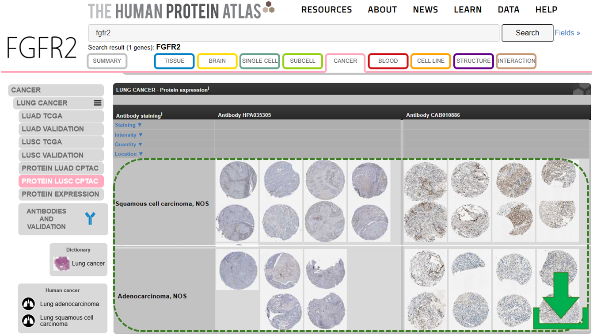
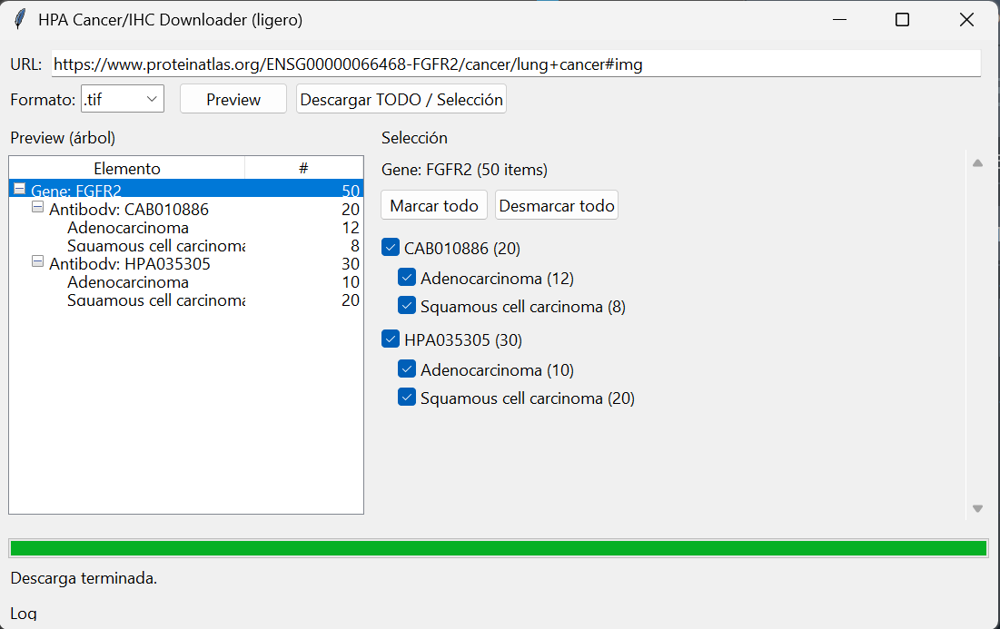

# HPA Cancer/IHC Image Downloader

A lightweight GUI application for structured and selective downloading of immunohistochemistry (IHC) cancer images from the Human Protein Atlas (HPA).




This tool supports reproducible digital pathology workflows by organizing downloads by **Gene → Antibody → Cancer subtype** and exporting **metadata CSV summaries**.

---

## Features

- URL-based automatic parsing of HPA cancer/IHC pages  
- Preview tree: **Gene → Antibody → Cancer subtype → image count**  
- Selective download (choose specific antibodies and/or cancer subtypes)  
- Export formats: **.jpg** or **.tif**  
- Automatic metadata extraction (patient/staining fields when available)  
- Retry-safe downloads  
- Standalone Windows executable available in **Releases**

---

## Quick Start (Windows Executable)

1. Download the latest `ImageDownloaderHPA.exe` from **Releases**
2. Run the executable
3. Paste a valid HPA cancer/IHC URL
4. Click **Preview**
5. Select what you need
6. Click **Download**

> Output is saved to: `~/Downloads/HPA Images/`

---

## Usage (Preview → Select → Download)

1. Paste a Human Protein Atlas cancer/IHC URL, for example:  
   `https://www.proteinatlas.org/ENSG00000077782-FGFR1/cancer/lung+cancer#img`

2. Click **Preview** to build the tree view and selection panel.

3. Choose:
   - Full antibodies
   - Specific cancer subtypes within each antibody

4. Choose output format: `.jpg` (default) or `.tif`.

5. Click **Download**.




---

## Output Folder Structure

```text
HPA Images/
└── GENE_NAME/
    ├── HPAxxxxxx/
    │   ├── CancerSubtypeA/
    │   │   ├── ID_patient_1.jpg
    │   │   ├── ID_patient_2.jpg
    │   │   └── CancerSubtypeA_summary.csv
    │   └── HPAxxxxxx_summary_all_images.csv
    └── GENE_all_antibodies_summary.csv