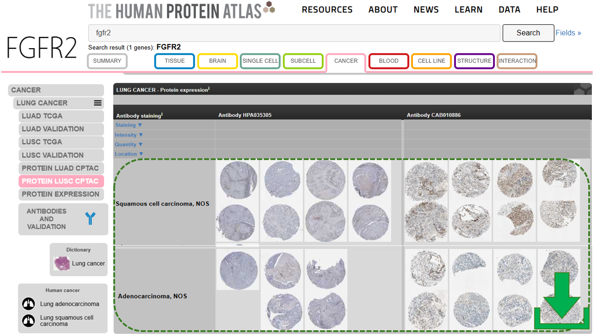
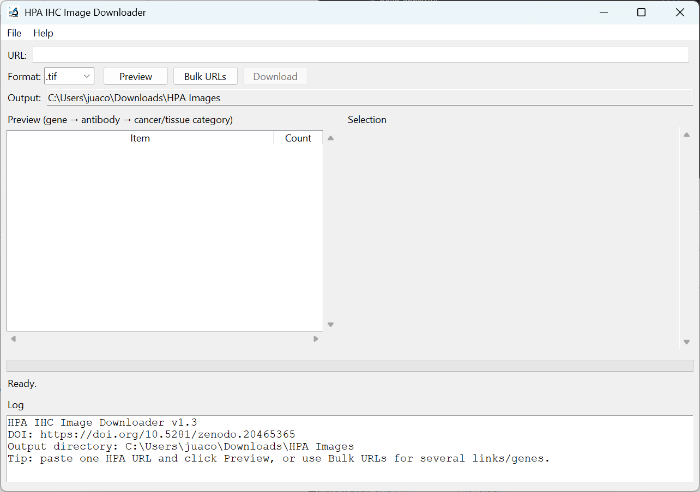

# HPA IHC Image Downloader

[](https://doi.org/10.5281/zenodo.20465365)

A lightweight graphical and command-line tool for previewing, selecting, downloading, organizing, and documenting immunohistochemistry (IHC) images from the Human Protein Atlas (HPA).

The tool supports HPA **cancer** and **normal tissue** pages and is designed for reproducible digital pathology workflows. Downloaded images are organized using a biomarker-centered structure:

```text
Marker / Antibody / HPA category / HPA diagnostic subtype when available
```



---

## Overview

HPA IHC Image Downloader helps users retrieve IHC images from Human Protein Atlas pages in a structured and reproducible way. Instead of manually browsing, selecting, saving, and organizing images, the software allows users to:

- Preview available images before downloading.
- Select specific genes, antibodies, HPA categories, and cancer diagnostic subtypes.
- Download images as `.tif` or `.jpg`.
- Automatically organize images into structured folders.
- Export metadata summaries, reproducibility reports, manifests, and file integrity checksums.

The software can be used through a graphical user interface (GUI) or through a command-line interface (CLI) for automated workflows.

---

## Main Features

- GUI-based workflow: **Preview → Select → Download**
- Command-line mode for reproducible and automated workflows
- Supports HPA cancer and normal tissue IHC pages
- Automatic parsing of HPA gene, antibody, category, and image metadata
- Preview tree organized by marker, antibody, and HPA category
- Cancer subtype selection when HPA diagnostic subtype information is available
- Fixed biomarker-centered output structure
- Export formats: `.tif` and `.jpg`
- Configurable output directory
- Retry-safe and streaming-based downloads
- Metadata CSV summaries
- Preview inventory export
- Download reports
- Separate CSV for failed downloads when failures occur
- JSON reproducibility manifest
- SHA256 checksums and file-size metadata for file integrity verification
- Standalone executables for Windows, macOS, and Linux available in Releases

---

## Quick Start with Pre-built Executables

Pre-built executables for Windows, macOS, and Linux are available in the **Releases** section.

| Operating System | Release File |
|------------------|-------------|
| Windows | `ImageDownloaderHPA-v1.3-windows.exe` |
| macOS | `HPA-Downloader-v1.3-macOS.zip` |
| Linux | `ImageDownloaderHPA-v1.3-linux` |

### Windows

1. Download `ImageDownloaderHPA-v1.3-windows.exe`.
2. Double-click the executable to start the application.

The first time you run it, Windows SmartScreen may show a warning. Click:

```text
More info → Run anyway
```

### macOS

1. Download `HPA-Downloader-v1.3-macOS.zip`.
2. Unzip the file.
3. Open the extracted application.

If macOS shows a security warning, right-click the app and choose **Open**.

### Linux

1. Download `ImageDownloaderHPA-v1.3-linux`.
2. Open a terminal in the download directory.
3. Run:

```bash
chmod +x ImageDownloaderHPA-v1.3-linux
./ImageDownloaderHPA-v1.3-linux
```

---

## Graphical User Interface Usage

### Basic workflow

1. Paste a Human Protein Atlas URL in the URL box.

Example:

```text
https://www.proteinatlas.org/ENSG00000066468-FGFR2/cancer/lung+cancer
```

2. Choose the image format:
   - `.tif` for maximum quality
   - `.jpg` for smaller files

3. Click **Preview**.

4. Review the available:
   - marker / gene
   - antibody
   - HPA category
   - cancer diagnostic subtype, when available

5. Select the items you want to download.

6. Click **Download selected**.

7. Use:

```text
File → Open Output Directory
```

to inspect downloaded images and reports.



---

## Bulk URL Mode

The software can process several HPA URLs in one run.

1. Open:

```text
File → Bulk URLs
```

2. Add or paste several HPA URLs.

3. Optionally load a `.txt` or `.csv` file containing URLs.

4. Click **Preview URLs**.

5. Select the desired antibodies, categories, and cancer diagnostic subtypes.

6. Click **Download selected**.

Example URL list:

```text
https://www.proteinatlas.org/ENSG00000066468-FGFR2/cancer/lung+cancer
https://www.proteinatlas.org/ENSG00000146648-EGFR/cancer/lung+cancer
https://www.proteinatlas.org/ENSG00000157764-BRAF/tissue/esophagus
```

---

## Supported HPA Pages

The tool supports URLs such as:

### Specific cancer category

```text
https://www.proteinatlas.org/ENSG00000066468-FGFR2/cancer/lung+cancer
```

### Cancer overview page

```text
https://www.proteinatlas.org/ENSG00000066468-FGFR2/cancer
```

Cancer overview pages are expanded into available HPA cancer categories during preview.

### Specific normal tissue page

```text
https://www.proteinatlas.org/ENSG00000157764-BRAF/tissue/esophagus
```

### Tissue overview page

```text
https://www.proteinatlas.org/ENSG00000157764-BRAF/tissue
```

For normal tissue pages, diagnostic subtype selection is not shown because HPA diagnostic subtypes are specific to cancer pages.

---

## Output Folder Structure

Downloaded images are stored using a fixed biomarker-centered structure:

```text
HPA Images/
└── GENE/
    └── ANTIBODY_ID/
        └── HPA category/
            └── HPA diagnostic subtype when available/
                └── ID_patient_index.tif
```

Example:

```text
HPA Images/
└── FGFR2/
    ├── CAB010886/
    │   └── lung cancer/
    │       ├── Adenocarcinoma/
    │       │   ├── ID_1506_1.tif
    │       │   └── ID_2100_1.tif
    │       └── Squamous cell carcinoma/
    │           └── ID_3001_1.tif
    └── HPA035305/
        └── lung cancer/
            └── Adenocarcinoma/
                └── ID_1801_1.tif
```

For normal tissue pages:

```text
HPA Images/
└── GENE/
    └── ANTIBODY_ID/
        └── Esophagus/
            ├── ID_patient_1.tif
            └── ID_patient_2.tif
```

---

## Exported Reports and Metadata

The software exports several files to support reproducibility and downstream analysis.

### Preview outputs

After preview, the tool creates a folder such as:

```text
HPA_preview_inventory_YYYYMMDD_HHMMSS/
```

containing:

```text
preview_inventory.csv
preview_manifest.json
preview_report.md
citation_and_methods_helper.md
```

### Download outputs

After download, the tool creates a folder such as:

```text
HPA_download_report_YYYYMMDD_HHMMSS/
```

containing:

```text
downloaded_successfully.csv
failed_downloads.csv
download_manifest.json
download_report.md
citation_and_methods_helper.md
```

`failed_downloads.csv` is created only when one or more files fail to download.

---

## Metadata Columns## Metadata Columns

Exported CSV files include image-level metadata and download audit information. 
The exact columns may vary depending on the HPA page and the metadata available for each image.

Main metadata fields include:

- Gene
- HPASection
- AntibodyID
- Category
- DiagnosticCategory
- ImageName
- ImageLink
- StoredRelativePath
- PatientID
- Gender
- Age
- Tissue
- Diagnosis
- AnnotationType
- AntibodyStaining
- Intensity
- Quantity
- Location
- AnnotationSummary

Download and reproducibility fields include:

- DownloadStatus
- FailureReason
- FileSizeBytes
- SHA256
- DownloadDate
- SoftwareVersion

Additional technical columns, such as folder-safe category names and HPA codes, may also be included to support reproducibility and downstream analysis.

---

## SHA256 and File Integrity

The tool computes SHA256 checksums for downloaded or already available files.

SHA256 is a file fingerprint. If the file content changes, the SHA256 value changes. This allows users to verify that files are unchanged, detect corrupted files, and support reproducible dataset documentation.

Example:

```text
ImageName,FileSizeBytes,SHA256
ID_1506_1.tif,8423912,a3f4c2...
```

---

## Command-line Usage

The tool can also be used from the command line. This is useful for batch processing, servers, and reproducible pipelines.

### Preview only

```bash
python src/ImageDownloaderHPA.py \
  --url-file urls.txt \
  --output "HPA Images" \
  --format .tif \
  --preview-only
```

### Preview and download

```bash
python src/ImageDownloaderHPA.py \
  --url-file urls.txt \
  --output "HPA Images" \
  --format .tif
```

### Direct URL input

```bash
python src/ImageDownloaderHPA.py \
  --urls "https://www.proteinatlas.org/ENSG00000066468-FGFR2/cancer/lung+cancer" \
  --output "HPA Images" \
  --format .tif
```

### Command-line options

| Option | Description |
|--------|-------------|
| `--urls` | One or more HPA URLs |
| `--url-file` | Text or CSV file containing HPA URLs |
| `--output` | Output directory |
| `--format` | Image format: `.tif` or `.jpg` |
| `--preview-only` | Export preview inventory without downloading images |
| `--download` | Explicitly download all previewed items |

Running the script without command-line arguments opens the graphical interface.

---

## Installation from Source

Requires Python 3.9 or newer.

Clone the repository:

```bash
git clone https://github.com/Juaco2r/HPADownloader.git
cd HPADownloader
```

Install dependencies:

```bash
pip install -r requirements.txt
```

Run the graphical interface:

```bash
python src/ImageDownloaderHPA.py
```

Run the command-line interface:

```bash
python src/ImageDownloaderHPA.py --help
```

---

## Dependencies

The application uses standard Python libraries plus the following external packages:

```text
requests
beautifulsoup4
lxml
```

Install them with:

```bash
pip install -r requirements.txt
```

---

## Example Use Case

Example input:

```text
https://www.proteinatlas.org/ENSG00000066468-FGFR2/cancer/lung+cancer
```

The software can identify available antibodies, image records, HPA cancer categories, and diagnostic subtypes when present. The user can then selectively download only the desired antibody-category-subtype combinations.

Example output:

```text
HPA Images/
└── FGFR2/
    └── CAB010886/
        └── lung cancer/
            ├── Adenocarcinoma/
            │   └── ID_1506_1.tif
            └── Squamous cell carcinoma/
                └── ID_3001_1.tif
```

Associated metadata and reports are exported automatically.

---

## Reproducibility

Each run can generate:

- a preview inventory
- a download report
- a JSON manifest
- metadata CSV files
- SHA256 checksums
- software version information
- source URL records
- citation and methods helper text

This allows users to document exactly which HPA URLs were used, which image records were available, which files were downloaded, and whether any downloads failed.

---

## Citation

If you use this software in research, please cite the archived version:

Rodríguez-Rojas J. (2026).  
**HPA IHC Image Downloader (v1.3)**.  
Zenodo.  
https://doi.org/10.5281/zenodo.20465365

Source code:  
https://github.com/Juaco2r/HPADownloader

---

## License

This project is released under the MIT License. Please see the `LICENSE` file for usage terms.
